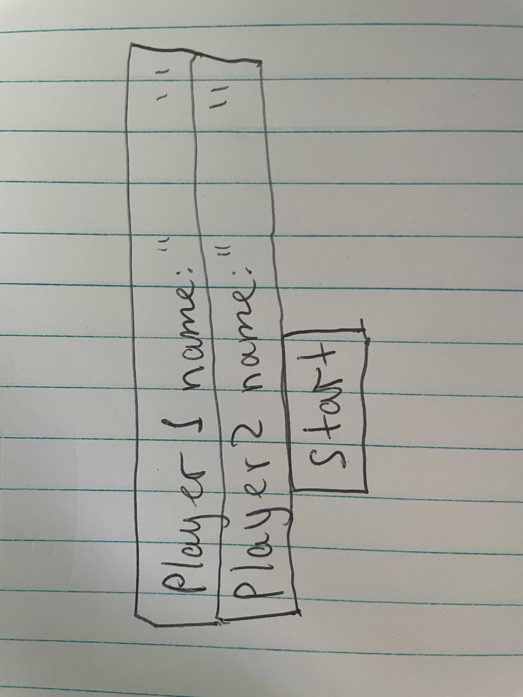
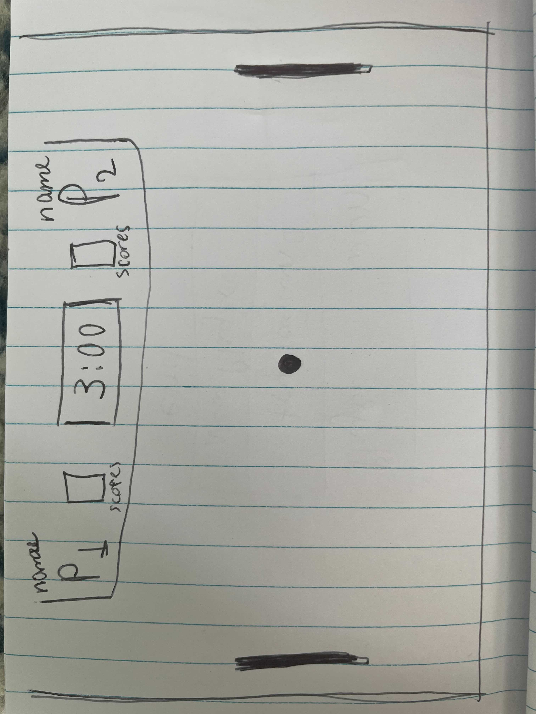

Project_1
main-idea: Pong Game
Backup-idea: Pair Game

For my main idea(pong game), I am going to create a field for two players. 
Each player shound be able to move their paddle vertically across right and left sides 
of the screen. By controlling the paddles they can hit the moving back and forth ball.
They are going to compete vs each other, to score the ball and win the game!

rules: 
- The player who gets '6 scores' first wins!
- 3:00 min lasts one match, by the end of the time, players that has more points wins!
If the players have same points, it's a draw!

