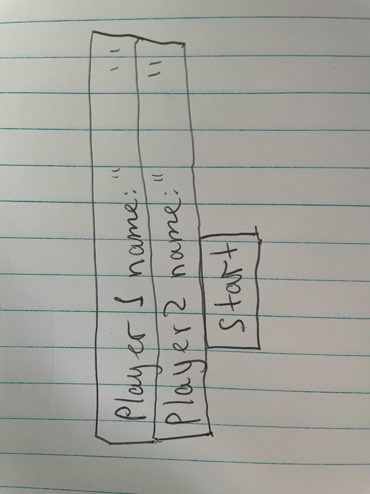
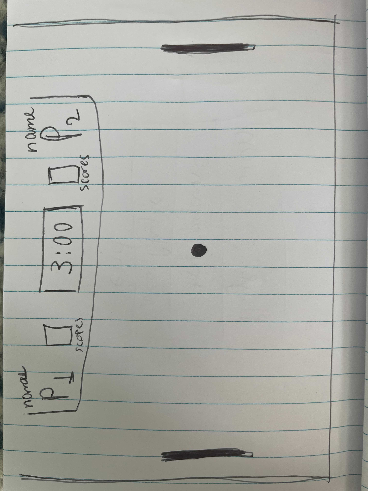
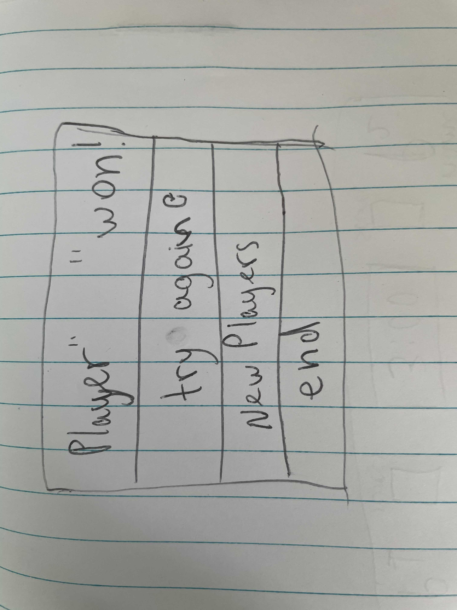

<!-- should be in the root of project ( 1 level up ) -->
<!-- doing so is best practice, github will pick it up and display it by default on your page instead of a user having to go look for it - many won't -->

<!-- our readme's are super important, especially when we start sharing our work with potential employers. so we should definitely put more effort in here  -->
<!-- because i can't stress it enough -->
<!-- READMES ARE IMPORTANT -->

<!-- using some markdown goodness : https://www.markdownguide.org/cheat-sheet/ -->
<!-- make it a header -->
Project_1
main-idea: Pong Game
<!-- remove back up idea, you made pong - own it -->
Backup-idea: Pair Game
<!-- rewrite this sentence to be 'This is x for y' -->
<!-- it's no longer a proposal - you did the thing -->
For my main idea(pong game), I am going to create a field for two players. 

<!-- while your working in here add a screenshot of your deployed app! (HERE)-->

<!-- change the user stories to follow best practice ( current tense, as i play i want to move my paddle vertically etc.) -->
<!-- try and break up the user stories so that you have at least 6, its totally ok to have 1 for moving the paddle, another for deflecting the ball, another for keeping score, etc.   -->
<!-- this is because our user stories should reflect our development tasks / process, so each user story is a check point / mini goal for us to hit along the way   -->
<!-- not a bad idea to be making commits as we hit our user stories as well - will increase your commit # to be closer to best practices / expected professionalism -->

<!-- label them as user stories -->
<!-- mind your spelling  -->
Each player should* be able to move their paddle vertically across right and left sides 
of the screen. By controlling the paddles they can hit the moving back and forth ball.
They are going to compete vs each other, to score the ball and win the game!
<!-- bling up your markdown with headers and sections -->
rules: 
- The player who gets '6 scores' first wins!
- 3:00 min lasts one match, by the end of the time, players that has more points wins!
If the players have same points, it's a draw!
<!-- add alt text to your images ( inside the []'s ) -->
<!-- rotate your pictures !  -->
<!-- when you move this file you will have to change the path for these images, leave them behind in the readme file, but do us all a favor and rename it to something like readmeAssets or readmePictures ( 1: it's more descriptive, 2: no spaces will make the pathing easier for you) -->

